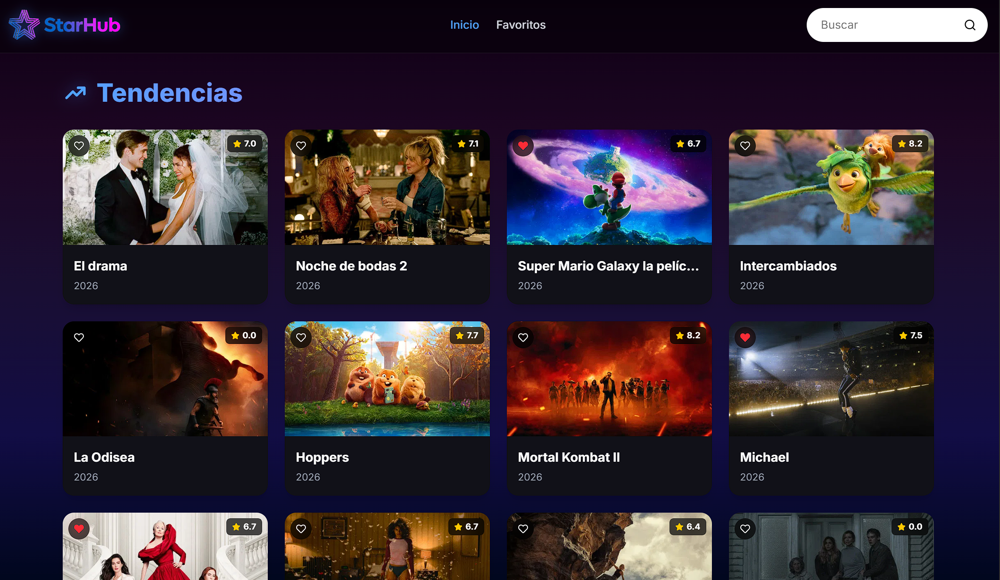

# StarHub - Catálogo de Películas.



StarHub es una Single Page Application (SPA) moderna desarrollada en React que permite descubrir a los usuarios las peliculas en tendencia y buscar sus titulos favoritos. Consume la API oficial de TMDB y destaca por una interfaz de usuario inmersiva con efectos de Glassmorphismo y Parallax.

**[Aplicacion en vivo aqui:](https://starhubapp.netlify.app/)**

## Características Principales.

- *Exploración de Tendencias:* Visualiza las peliculas mas populares del momento actualizadas en tiempo real.
- *Búsqueda Dinámica:* Encuentra películas específicas al instante a través de la barra de busqueda integrada.
- *Vista de Detalles Inmersiva:* Paginas dinámicas para cada pelicula con sinopsis, calificación, géneros y un fondo con efecto Parallax.
- *Diseño UI/UX Premium:* Interfaz oscura (Dark Mode) con fondos multicapa, degradados modernos y Navbar con efecto de vidrio esmerilado (Glassmorphism).
- *Responsive Design:* Perfectamente adaptable a dispositivos móviles, tablets y computadoras de escritorio.

## Tecnologias Utilizadas.
- **Frontend:** React 18, Vite.
- **Estilos:** Tailwind CSS v4.
- **Enrutamiento:** React Router DOM v6.
- **Iconos:** React Icons.
- **API:** TMDB (The Movie Database) API.
- **Despliegue:** Netlify.

## Instalación Local

Si deseas correr este proyecto en tu entorno local, sigue estos pasos:

1.Clona este repositorio:
```bash
git clone https://github.com/darthsanz/StarHub_App.git
```

2. Navega a la carpeta del proyecto:
```bash
cd StarHub_App
```

3.Instala las dependencias:
```bash
npm install
```

4.Configura tus variables de entorno:
* Crea un archivo`.env`en la raiz del proyecto.
* Agrega tu API Key de TMDB: `VITE_TMDB_API_KEY=coloca_tu_propia_llave_aqui`


5.Inicia el servidor de desarrollo:
```bash
npm run dev
```

## Autor
 * GitHub: @darthsanz