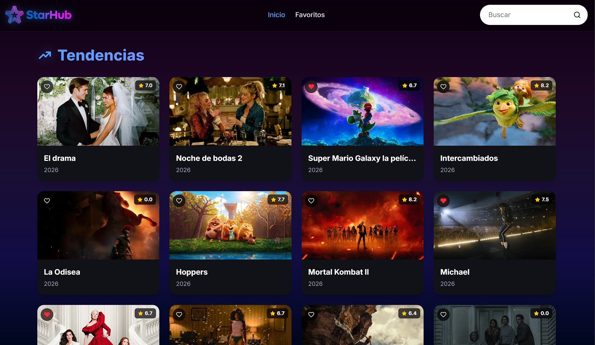

# StarHub - Catálogo de Películas.



StarHub es una **Single Page Application (SPA)** moderna y de alto rendimiento desarrollada en React. Esta aplicación permite a los usuarios explorar las últimas tendencias del cine, gestionar una lista personal de favoritos y disfrutar de una experiencia de usuario inmersiva impulsada por la API oficial de TMDB.
**[Aplicacion en vivo aqui:](https://starhubapp.netlify.app/)**

---

## Características Principales

### Exploración y Descubrimiento
- **Tendencias en Tiempo Real:** Visualiza las películas más populares del momento, actualizadas directamente desde TMDB.
- **Scroll Infinito (Nuevo):** Implementación de la API nativa `Intersection Observer` para cargar más contenido de forma fluida mientras el usuario navega, eliminando la paginación lenta.
- **Búsqueda Inteligente con Debounce (Nuevo):** Barra de búsqueda optimizada que reduce las peticiones innecesarias a la API, mejorando el rendimiento y la velocidad de respuesta.

### Experiencia de Usuario (UX/UI)
- **Gestión de Favoritos (Nuevo):** Sistema persistente mediante `LocalStorage` y `Context API`. Guarda tus películas favoritas y accede a ellas incluso después de cerrar el navegador.
- **Skeleton Loaders (Nuevo):** Pantallas de carga elegantes que eliminan los saltos visuales y mejoran la percepción de velocidad de la aplicación.
- **Vista de Detalles Inmersiva:** Páginas dinámicas con sinopsis, calificación, géneros y un fondo con efecto **Parallax**.
- **Diseño Premium:** Interfaz oscura (Dark Mode) con efectos de **Glassmorphism** (vidrio esmerilado) y degradados modernos.

### Optimización
- **Responsive Design:** Adaptabilidad total desde dispositivos móviles hasta pantallas de escritorio de gran formato.
- **Rendimiento:** Optimización de renderizado mediante el uso eficiente de Hooks de React.

---

## Tecnologias Utilizadas.
- **Núcleo:** React 18, Vite.
- **Estado Global:** Context API (Gestión de favoritos).
- **Estilos:** Tailwind CSS v4.
- **Navegación:** React Router DOM v6.
- **Iconografía:** React Icons & Lucide React.
- **Datos:** TMDB (The Movie Database) API.
- **Despliegue:** Netlify.

## Instalación Local

Si deseas correr este proyecto en tu entorno local, sigue estos pasos:

1.Clona este repositorio:
```bash
git clone https://github.com/darthsanz/StarHub_App.git
```

2. Navega a la carpeta del proyecto:
```bash
cd StarHub_App
```

3.Instala las dependencias:
```bash
npm install
```

4.Configura tus variables de entorno:
* Crea un archivo`.env`en la raiz del proyecto.
* Agrega tu API Key de TMDB: `VITE_TMDB_API_KEY=coloca_tu_propia_llave_aqui`


5.Inicia el servidor de desarrollo:
```bash
npm run dev
```

## Autor
 * GitHub: @darthsanz